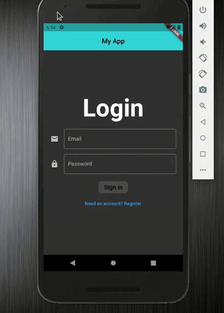
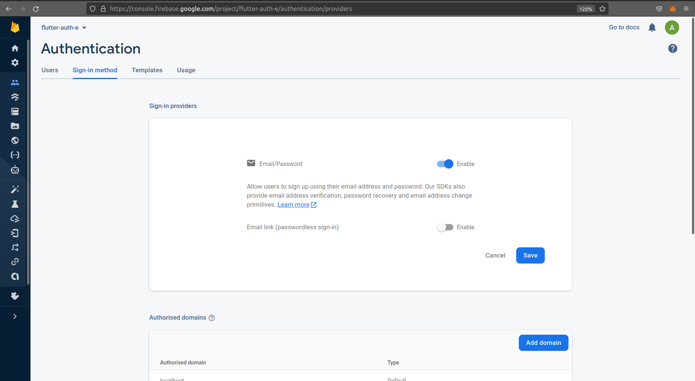
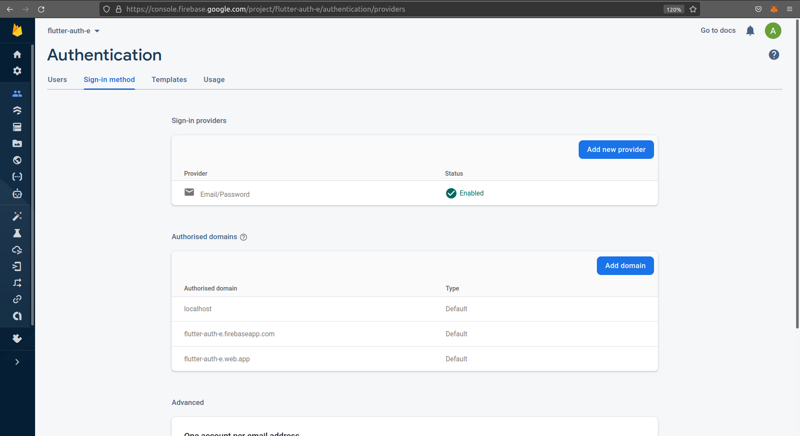
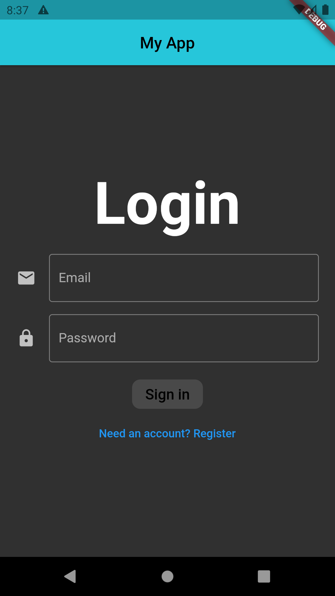
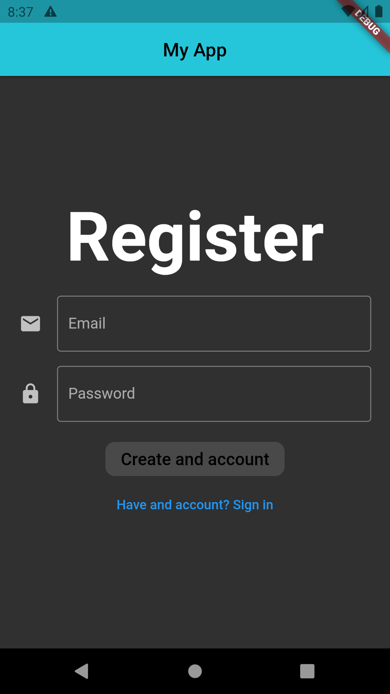
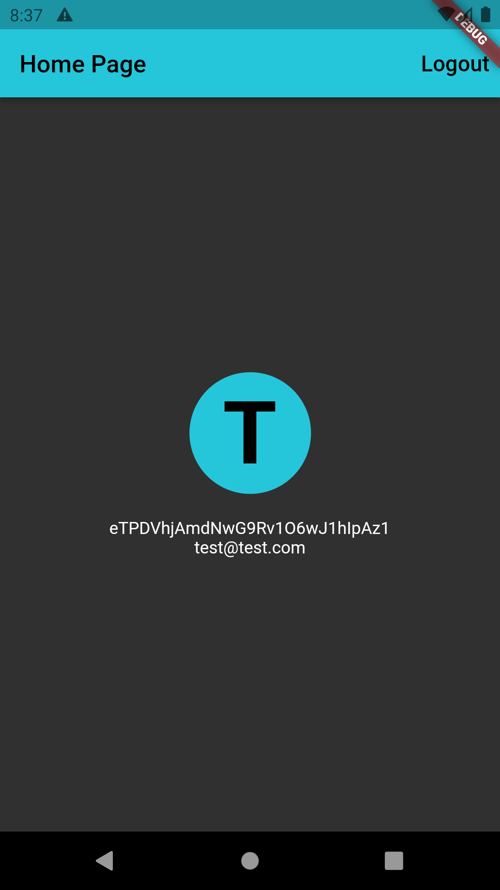
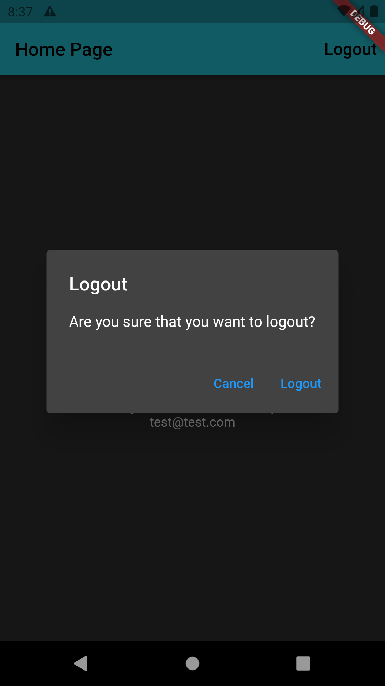
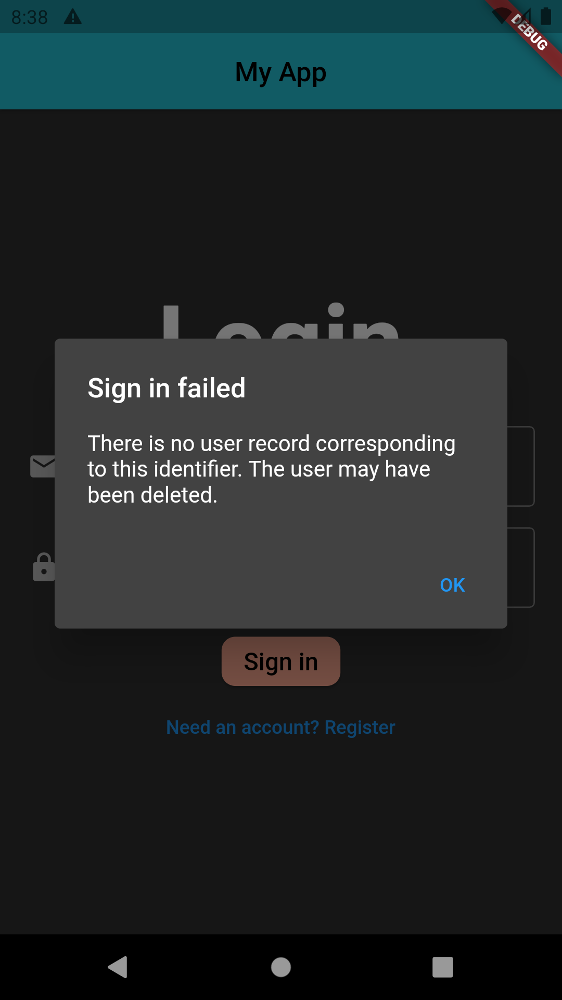
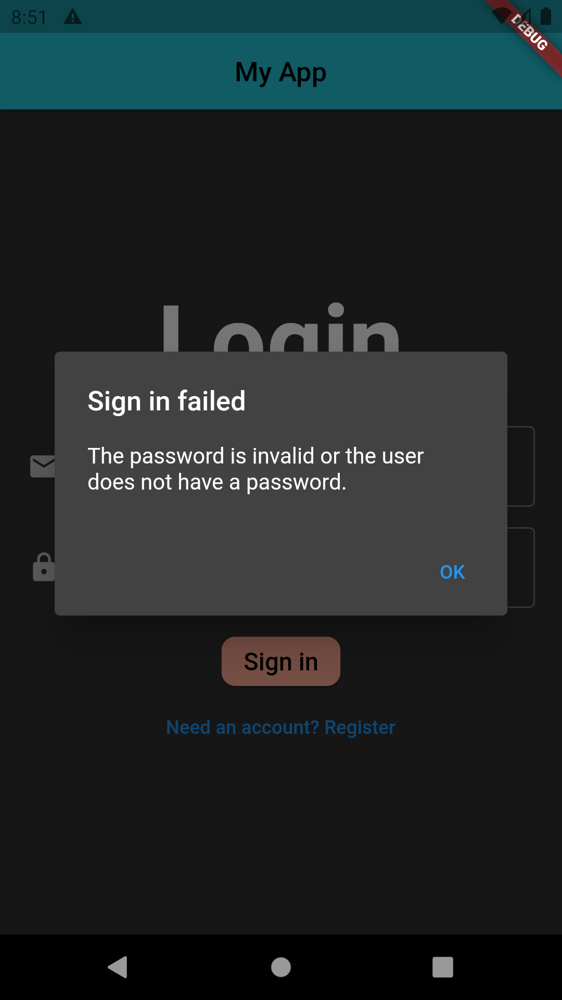

# Table of contents:
- [Firebase Project Configuration](#firebase-project-configuration)
- [Installing the fireabase_auth package](#installing-the-fireabase_auth-package)
- [Landing Page Logic](#landing-page-logic)
- [Firebase Authentication Service](#firebase-authentication-service)
- [Adding the Provider package](#adding-the-provider-package)
- [Implementing EmailSignInModel class](#implementing-emailsigninmodel-class)
- [Adding a StringValidator class](#adding-a-stringvalidator-class)
- [Completing the EmailSignInModel class](#completing-the-emailsigninmodel-class)
- [Implementing EmailSignInForm](#implementing-emailsigninform)
- [Dispose Method](#dispose-method)
- [EmailSignInForm with ChangeNotifier](#emailsigninform-with-changenotifier)
- [Completing SignInPage](#completing-signinpage)
- [StremBuilder in LandingPage](#strembuilder-in-landingpage)
- [Accessing Current User in HomePage](#accessing-current-user-in-homepage)
- [Screenshot](#screenshot)
- [Wrap Up](#wrap-up)
- [Error](#error)

# Overview


# Firebase Project Configuration
## Installation
Before any Firebase services can be used, you must first install the `firebase_core` plugin, which is responsible for connecting your application to Firebase.

Install the plugin by adding a line like this to your package's `pubspec.yaml` (and run an implicit `flutter pub get`):
```yaml
dependencies:
  firebase_core: ^1.11.0
```

## Initialization using CLI
Running the following command from the project root:
```shell
# Install the CLI if not already done so
dart pub global activate flutterfire_cli

# Run the `configure` command, select a Firebase project and platforms
flutterfire configure
```

```shell
aniket@aniket:~/FlutterGitMyProjects/flutter_auth_example$ dart pub global activate flutterfire_cli
Package flutterfire_cli is currently active at version 0.1.1+2.
Resolving dependencies... (2.7s)
....
Downloading win32 2.3.8...
Building package executables... (4.8s)
Built flutterfire_cli:flutterfire.
Installed executable flutterfire.
Activated flutterfire_cli 0.1.1+2.
aniket@aniket:~/FlutterGitMyProjects/flutter_auth_example$ flutterfire configure
i Found 4 Firebase projects.
✔ Select a Firebase project to configure your Flutter application with · <create a new project>
✔ Enter a project id for your new Firebase project (e.g. my-cool-project) · flutter-auth-e
i New Firebase project flutter-auth-e created succesfully.
✔ Which platforms should your configuration support (use arrow keys & space to select)? · android
i Firebase android app com.example.flutter_auth_example is not registered on Firebase project flutter-auth-e.
i Registered a new Firebase android app on Firebase project flutter-auth-e.

Firebase configuration file lib/firebase_options.dart generated successfully with the following Firebase apps:

Platform  Firebase App Id
android   1:XXXXXXXXX:android:XXXXXXXXXXX

Learn more about using this file in the FlutterFire documentation:
 > https://firebase.flutter.dev/docs/cli
aniket@aniket:~/FlutterGitMyProjects/flutter_auth_example$
```

Once configured, a `firebase_options.dart` file will be generated for you containing all the options required for initialization.

Next import the `firebase_core` plugin and generated `firebase_options.dart` file:
- `lib/main.dart`
```dart
import 'package:firebase_core/firebase_core.dart';
import 'firebase_options.dart';
```

Next, within the `main` function, ensure `WidgetsFlutterBinding` is initialized and then initialize Firebase:
- `lib/main.dart`

```dart
void main() async {
  WidgetsFlutterBinding.ensureInitialized();
  await Firebase.initializeApp(
    options: DefaultFirebaseOptions.currentPlatform,
  );
  runApp(const MyApp());
}
```

The `DefaultFirebaseOptions.currentPlatform` are imported from our generated `firebase_options.dart` file.

Once initialized, you're ready to get started using Firebase with Flutter!

# Installing the fireabase_auth package
Add a line like this to your package’s `pubspec.yaml` (and run an implicit `flutter pub get`):
```yaml
dependencies:
  firebase_auth: ^3.3.5
```

Next, Head over to the firebase console from here https://console.firebase.google.com/ . Select your appropriate project.
- In the left tap select the **Authentication** icon.
   - **Get Started** and open **Sign-in method** tab.
   - From the **Provider** enable `Email/Password` option.

|      |      |
|:------:|:-------
|  | 

# Landing Page Logic
Creting a new dart file and folder as:
```text
flutter_auth_example
   lib
     pages
        sign_in_page.dart
```

- `sign_in_page.dart`

```dart
import 'package:flutter/material.dart';

class SignInPage extends StatelessWidget {
  @override
  Widget build(BuildContext context) {
    return Scaffold(
      appBar: AppBar(
        title: const Text(
          "My App",
          style: TextStyle(color: Colors.black),
        ),
        centerTitle: true,
        elevation: 2.0,
        backgroundColor: Colors.cyan[400],
      ),
      body: Container()
    );
  }
}
```

Creating another new dart file inside **pages** folder as `home_page.dart`:
- `home_page.dart`

```dart
import 'package:flutter/material.dart';

class HomePage extends StatelessWidget {
  const HomePage({ Key? key }) : super(key: key);

  @override
  Widget build(BuildContext context) {
    return Container(
      
    );
  }
}
```

Creating another new dart file inside **pages** folder as `landing_page.dart`:
- `landing_page.dart`

```dart
import 'package:flutter/material.dart';
import 'package:flutter_auth_example/pages/sign_in_page.dart';

class LandingPage extends StatefulWidget {
  const LandingPage({Key? key}) : super(key: key);

  @override
  _LandingPageState createState() => _LandingPageState();
}

class _LandingPageState extends State<LandingPage> {
  @override
  Widget build(BuildContext context) {
    return SignInPage();
  }
}
```
LandingPage widget will actually decide whether we show the SignInPage or the HomePage.
If the user is not signed-in we’ll show the SignInPage and if the user is signed-in then we’ll show the HomePage.

Now from the `main.dart` calling the **LandingPage** as:
```dart
class MyApp extends StatelessWidget {
  const MyApp({Key? key}) : super(key: key);
  @override
  Widget build(BuildContext context) {
    return MaterialApp(
        title: "Time Tracker",
        theme: ThemeData(
          primarySwatch: Colors.indigo,
        ),
        home: LandingPage());
  }
}
```

# Firebase Authentication Service
We will be adding all the firebase authentication code inside a new class called **Auth**. For that creating a new folder as **services** and inside of that creating a new file as `auth.dart`:
```text
flutter_auth_example
   lib
     services
        auth.dart
```

- auth.dart

```dart
import 'package:firebase_auth/firebase_auth.dart';

class Auth implements AuthBase {
  final _firebaseAuth = FirebaseAuth.instance;

  // <#1>
  UserModel? _userFromFirebase(User? user) {
    if (user == null) {
      return null;
    }
    return UserModel(uid: user.uid, email: user.email!);
  }

  // <#2>
  @override
  Stream<UserModel?> get onAuthStateChanged {
    return _firebaseAuth.authStateChanges().map(_userFromFirebase);
  }

  // <#3>
  @override
  Future<UserModel?> currentUser() async {
    final user = _firebaseAuth.currentUser;
    return _userFromFirebase(user);
  }

  // <#4>
  @override
  Future<UserModel?> signInWithEmailAndPassword(
      String email, String password) async {
    final authResult = await _firebaseAuth.signInWithEmailAndPassword(
        email: email, password: password);

    return _userFromFirebase(authResult.user);
  }

  // <#5>
  @override
  Future<UserModel?> createUserWithEmailAndPassword(
      String email, String password) async {
    final authResult = await _firebaseAuth.createUserWithEmailAndPassword(
        email: email, password: password);

    return _userFromFirebase(authResult.user);
  }

  // <#6>
  @override
  Future<void> signOut() async {
    return await _firebaseAuth.signOut();
  }
}
```
1. `_userFromFirebase` method is used to create an object of type **UserModel** from an object of type firebase **User**.
2. `onAuthStateChanged` is Stream of type `UserModel?`. Well streams can take any type of data as an input, however in the above variable we are using `Stream<UserModel?>` this syntax to specify that this stream will only hold data items of type `UserModel?`.
3. `currentUser()` is used to check if the user is currently logged-in or not  when we start the application.
4. `signInWithEmailAndPassword` attempts to sign in a user with the given email address and password.
5. `createUserWithEmailAndPassword` tries to create a new user account with the given email address and password.
6. `signOut()` signs out the current user.


We’d introduced the above Auth class because:
   - We want to decouple all the authentication code from Firebase.

Next we need to create a new generic **UserModel** class.
Creating a new **UserModel** class inside `auth.dart` as:
```dart
class UserModel {
  final String uid;
  final String email;
  UserModel({required this.uid, required this.email});
}
```

Next we’ll define a public interface **AuthBase** which will list all the firebase methods that we need, and allow the **Auth** class to implements this public interface.

To define a public interface we can use a feature of the dart language called an **abstract** class.

Therefore creating a new abstract class inside `auth.dart` as:
```dart
abstract class AuthBase {
  Stream<UserModel?> get onAuthStateChanged;
  Future<UserModel?> currentUser();
  Future<UserModel?> signInWithEmailAndPassword(String email, String password);
  Future<UserModel?> createUserWithEmailAndPassword(
      String email, String password);
  Future<void> signOut();
}
```

Uptill now we have created **AuthBase** abstract class for our **Auth** class and we’re going to use it to access the authentication API in the rest of our project.

Therefore from all the above changes the public interface of the **Auth** class is completely decoupled from firebase. And our goal for the rest of the application is to only know about the **AuthBase** class and **UserModel** object and never reference FirebaseAuth directly.

One of the advantage of this approach is that if there are any breaking changes in the future versions of `firebase_auth` all we have to do is to update our **Auth** class.

# Adding the Provider package
Going forward we’ll be using provider (https://pub.dev/packages/provider) to solve all our problems when it comes to accessing objects.

**InheritedWidget** is very important widget in Flutter. But going forward we’re going to use the **provider** package instead, because this builds upon **InheritedWidget** and makes it much easier to access objects and dependencies in our widget tree.

Installing Provider
```yaml
dependencies:
  provider: ^6.0.2
```
Add a line like this to your package’s pubspec.yaml (and run an implicit `flutter pub get`)

### Using the provider class
- `main.dart`
   - Wrapping **MaterialApp** into Provider as:

```dart
   class MyApp extends StatelessWidget {
  const MyApp({Key? key}) : super(key: key);

  ThemeData _buildAppTheme() {
    final ThemeData base = ThemeData.dark();
    return base.copyWith(
        brightness: Brightness.dark,
        textTheme: const TextTheme(
            headline1: TextStyle(fontSize: 72, fontWeight: FontWeight.bold),
            bodyText1: TextStyle(fontSize: 18.0)));
  }

  @override
  Widget build(BuildContext context) {
    return Provider<AuthBase>(
      create: (context) => Auth(),
      child: MaterialApp(
        title: 'Flutter Demo',
        theme: _buildAppTheme(),
        home: LandingPage(),
      ),
    );
  }
}
```
Also **ThemeData** is modified there to give a global form of styling to our app.

# Implementing EmailSignInModel class
Creatin a new dart file and folder as:
```text
flutter_auth_example
   lib
     pages
        sign_in
           email_sign_in_model.dart
```

- `email_sign_in_model.dart`
   - Defining **EmailSignInFormType** `enum` as:
```dart
   enum EmailSignInFormType { signIn, register }
```

Now implementing **EmailSignInModel** class as:
```dart
import 'package:flutter/material.dart';
import 'package:flutter_auth_example/services/auth.dart';
import 'package:flutter_auth_example/utils/validators.dart';

enum EmailSignInFormType { signIn, register }

class EmailSignInModel with EmailAndPasswordValidators, ChangeNotifier {
  EmailSignInModel(
      {this.email = "",
      this.password = "",
      this.formType = EmailSignInFormType.signIn,
      this.isLoading = false,
      this.submitted = false,
      required this.auth});

  String email;
  String password;
  EmailSignInFormType formType;
  bool isLoading;
  bool submitted;
  final AuthBase auth;
}
```
- Adding EmailAndPasswordValidators, ChangeNotifier as a mixin to EmailSignInModel class.
   - When we add a mixin to a class then that class has access to all the methods in the mixin. 

Next we need to update our model, defining a new method inside **EmailSignInModel** class as:
```dart
  void updateWith(
      {String? email,
      String? password,
      EmailSignInFormType? formType,
      bool? isLoading,
      bool? submitted}) {
    this.email = email ?? this.email;
    this.password = password ?? this.password;
    this.formType = formType ?? this.formType;
    this.isLoading = isLoading ?? this.isLoading;
    this.submitted = submitted ?? this.submitted;
    notifyListeners();
  }
```
`notifyListeners()` which is a method inside **ChangeNotifier** class interface, It Call all the registered listeners. We should call this method whenever the object changes, to notify any clients the object may have changed.

Implementing few conditional logic inside of the **EmailSignInModel** class as:
```dart
....
  String get headerText {
    return formType == EmailSignInFormType.signIn ? "Login" : "Register";
  }

  String get primaryButtonText {
    return formType == EmailSignInFormType.signIn
        ? "Sign in"
        : "Create and account";
  }

  String get secondaryButtonText {
    return formType == EmailSignInFormType.signIn
        ? "Need an account? Register"
        : "Have and account? Sign in";
  }

  bool get canSubmit {
    return emailValidator.isValid(email) &&
        passwordValidator.isValid(password) &&
        !isLoading;
  }

  String? get passwordErrorText {
    bool showErrorText = submitted && !passwordValidator.isValid(password);
    return showErrorText ? invalidPasswordErrorText : null;
  }

  String? get emailErrorText {
    bool showErrorText = submitted && !emailValidator.isValid(email);
    return showErrorText ? invalidEmailErrorText : null;
  }

  void updateEmail(String email) => updateWith(email: email);
  void updatePassword(String password) => updateWith(password: password);

  void toggleFormType() {
    final formType = this.formType == EmailSignInFormType.signIn
        ? EmailSignInFormType.register
        : EmailSignInFormType.signIn;

    updateWith(
      email: "",
      password: "",
      formType: formType,
      submitted: false,
      isLoading: false,
    );
  }
....
```

# Adding a StringValidator class
Creating a new dart file and folder as:
```text
flutter_auth_example
   lib
     utils
        validators.dart
```

- `validators.dart`

```dart
abstract class StringValidator {
  bool isValid(String value);
}

class NonEmptyStringValidator implements StringValidator {
  @override
  bool isValid(String value) {
    return value.isNotEmpty;
  }
}

class EmailAndPasswordValidators {
  final String invalidEmailErrorText = "Email can't be empty";
  final String invalidPasswordErrorText = "Password can't be empty";

  final StringValidator emailValidator = NonEmptyStringValidator();
  final StringValidator passwordValidator = NonEmptyStringValidator();
}
```
The above declared class **EmailAndPasswordValidators** is actually a mixin of **EmailSignInModel**.

# Completing the EmailSignInModel class
- `email_sign_in_model.dart`
Implementing `_submit` method inside of the **EmailSignInModel** class as:
```dart
  Future<void> submit() async {
    updateWith(submitted: true, isLoading: true);
    try {
      if (formType == EmailSignInFormType.signIn) {
        await auth.signInWithEmailAndPassword(email, password);
      } else {
        await auth.createUserWithEmailAndPassword(email, password);
      }
    } catch (e) {
      updateWith(isLoading: false);
      rethrow;
    }
  }
```

# Implementing EmailSignInForm
Creating a new dart file inside `sign_in` folder as `email_sign_in_form.dart` as:
- `email_sign_in_form.dart`

```dart
import 'package:flutter/material.dart';
import 'package:flutter_auth_example/pages/sign_in/email_sign_in_model.dart';

class EmailSignInForm extends StatefulWidget {
  EmailSignInForm({Key? key, required this.model}) : super(key: key);
  final EmailSignInModel model;

  @override
  State<EmailSignInForm> createState() => _EmailSignInFormState();
}

class _EmailSignInFormState extends State<EmailSignInForm> {
  final TextEditingController? _emailController = TextEditingController();
  final TextEditingController? _passwordController = TextEditingController();

  final FocusNode _emailFocusNode = FocusNode();
  final FocusNode _passwordFocusNode = FocusNode();
  EmailSignInModel get model => widget.model;


  @override
  Widget build(BuildContext context) {
    return Container(
      padding: const EdgeInsets.symmetric(horizontal: 20.0),
      child: Center(
        child: SingleChildScrollView(
          child: Column(
            children: _buildChildren(),
          ),
        ),
      ),
    );
  }
}
```

Implementing `_buildChildren()` method as:
```dart
....
  List<Widget> _buildChildren() {
    return [
      _buildHeader(),
      const SizedBox(
        height: 20.0,
      ),
      _buildEmailTextField(),
      const SizedBox(
        height: 15.0,
      ),
      _buildPasswordTextField(),
      const SizedBox(
        height: 15.0,
      ),
      _buildFormActions(),
    ];
  }
....
```

Implementing `_buildHeader()` method as:
```dart
  Widget _buildHeader() {
    return Text(
      model.headerText,
      style: Theme.of(context).textTheme.headline1,
    );
  }
```
- The text is `model.headerText`, if **EmailSignInFormType** is signIn, it will display "Login" otherwise "Register".

Implementing `_buildEmailTextField` method as:
```dart
  Widget _buildEmailTextField() {
    return TextField(
      autocorrect: false,
      keyboardType: TextInputType.emailAddress,
      textInputAction: TextInputAction.next,
      controller: _emailController,
      decoration: InputDecoration(
          labelText: "Email",
          hintText: "test@test.com",
          border: OutlineInputBorder(),
          icon: Icon(Icons.mail),
          errorText: model.emailErrorText,
          enabled: model.isLoading == false),
      focusNode: _emailFocusNode,
      onEditingComplete: () => _emailEditingComplete(),
      onChanged: model.updateEmail,
    );
  }
```

Implementing `_buildPasswordTextField` method as:
```dart
  Widget _buildPasswordTextField() {
    return TextField(
      controller: _passwordController,
      obscureText: true,
      decoration: InputDecoration(
          labelText: "Password",
          border: OutlineInputBorder(),
          icon: Icon(Icons.lock),
          errorText: model.passwordErrorText,
          enabled: model.isLoading == false),
      textInputAction: TextInputAction.done,
      focusNode: _passwordFocusNode,
      onEditingComplete: _submit,
      onChanged: model.updatePassword,
    );
  }
```

Implementing `_buildFormActions` method as:
```dart
  Widget _buildFormActions() {
    if (model.isLoading) {
      return const CircularProgressIndicator();
    }
    return Column(
      children: [
        ElevatedButton(
          onPressed: model.canSubmit ? _submit : null,
          child: Text(
            model.primaryButtonText,
            style: Theme.of(context)
                .textTheme
                .bodyText1!
                .copyWith(color: Colors.black),
          ),
          style: ElevatedButton.styleFrom(
              primary: Colors.deepOrange[200],
              shape: const RoundedRectangleBorder(
                  borderRadius: BorderRadius.all(Radius.circular(10.0)))),
        ),
        TextButton(
            onPressed: !model.isLoading ? _toogleFormType : null,
            child: Text(
              model.secondaryButtonText,
            ))
      ],
    );
  }
```

Implementing several different helper methods as:

```dart
  Future<void> _submit() async {
    try {
      await model.submit();
    } on FirebaseException catch (e) {
      CustomAlertDialog(
        title: "Sign in failed",
        content: e.message!,
        defaultActionText: "OK",
      ).show(context);
    }
  }

  void _toogleFormType() {
    model.toggleFormType();
    _emailController!.clear();
    _passwordController!.clear();
  }

  void _emailEditingComplete() {
    final newFocus = model.emailValidator.isValid(model.email)
        ? _passwordFocusNode
        : _emailFocusNode;
    FocusScope.of(context).requestFocus(newFocus);
  }
```
The Firebase Authentication SDK provides a simple way for catching the various errors which may occur using authentication methods. FlutterFire exposes these errors via the `FirebaseException` class which we used in the `_submit()` method for catching the errors.

We're passing the error message(`e.message`) to the **CustomAlertDialog** class. So implementing a new dart file and folder as:
```text
flutter_auth_example
   lib
     common_widgets
        custom_alert_dialog.dart
```

- `custom_alert_dialog.dart`

```dart
import 'package:flutter/material.dart';

class CustomAlertDialog extends StatelessWidget {
  CustomAlertDialog(
      {Key? key,
      required this.title,
      required this.content,
      required this.defaultActionText,
      this.cancelActionText})
      : super(key: key);
  final String title;
  final String content;
  final String defaultActionText;
  final String? cancelActionText;

  Future<bool?> show(BuildContext context) async {
    return await showDialog<bool>(
        context: context,
        builder: (context) => this,
        barrierDismissible: false);
  }

  @override
  Widget build(BuildContext context) {
    return AlertDialog(
      title: Text(title),
      content: Text(content),
      actions: _buildActions(context),
    );
  }

  List<Widget> _buildActions(BuildContext context) {
    final actions = [];
    if (cancelActionText != null) {
      actions.add(
        TextButton(
          onPressed: () => Navigator.of(context).pop(false),
          child: Text(cancelActionText!),
        ),
      );
    }

    actions.add(
      TextButton(
        onPressed: () => Navigator.of(context).pop(true),
        child: Text(defaultActionText),
      ),
    );

    return List<Widget>.from(actions);
  }
}
```

# Dispose Method
`dispose` is a method of the state class and it is called when a widget is removed from the widget tree.
- `email_sign_in_form.dart`
   - Calling `dispose()` on **TextEditingController** and **FocusNode** objects when the parent StatefulWidget is disposed. Declaring `dispose()` method as:
```dart
....
  @override
  void dispose() {
    _emailController!.dispose();
    _passwordController!.dispose();
    _emailFocusNode.dispose();
    _passwordFocusNode.dispose();
    super.dispose();
  }
....
```

# EmailSignInForm with ChangeNotifier
**ChangeNotifier** is useful when we have a model class and we want to modify some listeners when that model class changes.
- `email_sign_in_form.dart`
   - We need to implement a static method that we can use to create this widget with a parent provider of type **EmailSignInModel** as:

```dart
class EmailSignInForm extends StatefulWidget {
  EmailSignInForm({Key? key, required this.model}) : super(key: key);
  final EmailSignInModel model;

  static Widget create(BuildContext context) {
    final AuthBase auth = Provider.of<AuthBase>(context);
    return ChangeNotifierProvider<EmailSignInModel>(
      create: (context) => EmailSignInModel(auth: auth),
      child: Consumer<EmailSignInModel>(
        builder: (context, model, _) => EmailSignInForm(
          model: model,
        ),
      ),
    );
  }

  @override
  State<EmailSignInForm> createState() => _EmailSignInFormState();
}
```

- How to use **ChangeNotifierProvider** ?
   - `builder` => create a model class based on **ChangeNotifier**.
   - Consumer(builder) => rebuilt every time notifyListeners is called.

Let’s talk about `create` method: Adding **Consumer** gives us a `builder`, what’s special about this is that builder is called every time value changes. All descendant widgets are rebuilt.

Using a **ChangeNotifierProvider** together with the **Consumer** widget gives us a convinent way to register for changes.

# Completing SignInPage
- `sign_in_page.dart`
   - From the SignInPage implementing the **EmailSignInForm** as a `body` of its Scaffold as:

```dart
class SignInPage extends StatelessWidget {
  @override
  Widget build(BuildContext context) {
    return Scaffold(
      appBar: AppBar(
        title: const Text(
          "My App",
          style: TextStyle(color: Colors.black),
        ),
        centerTitle: true,
        elevation: 2.0,
        backgroundColor: Colors.cyan[400],
      ),
      body: EmailSignInForm.create(context),
    );
  }
}
```

# StremBuilder in LandingPage
- `landing_page.dart`
   - Returning **StreamBuilder** from LandingPage build method as:

```dart
....
Widget build(BuildContext context) {
    final auth = Provider.of<AuthBase>(context, listen: false);
    return StreamBuilder<UserModel?>(
      stream: auth.onAuthStateChanged,
      builder: (context, snapshot) {
        if (snapshot.connectionState == ConnectionState.active) {
          UserModel? user = snapshot.data;
          if (user == null) {
            return SignInPage();
          }
          return HomePage();
        } else {
          return const Scaffold(
            body: Center(
              child: CircularProgressIndicator(),
            ),
          );
        }
      },
    );
  }
....
```
**StreamBuilder** is a widget that takes two parameter:
1. `stream:`
   - `auth.onAuthStateChanged` which is stream.
2. `builder:`
   - builder is acutally a method that is called everytime there is a new value on the stream.
   - It takes two parameters:
      1. `context`
      2. `snapshot`: This is an object that holds the data from our stream.
   - From the builder we need to return a widget that is built based on the data in the snapshot.

When there is no data in the snapshot (this could be either because we’ve not yet received the value of our stream or it could be because we’ve received an error) we’ll return `CircularProgressIndicator()`.
      
Then in the `builder` we check if the connectionState of the snapshot is active which tell us that we’ve received the first value on the stream.

Then we can read the value by using `snapshot.data` which is an object of type **UserModel?** and this could be either null in which case we return the **SignPage()** or it could be not null in which case we return the **HomePage()**.

Finally if the connection state is not active, then it means that we’ve yet to receive a value on the stream and in this case we show **CircularProgressIndicator()**.

# Accessing Current User in HomePage
- `landing_page.dart`
   - In `landing_page.dart` we’ve a user object, it is not null when we create the HomePage, so we can use the provider package to provide a user object to the HomePage and any of its children widgets. Therefore wraping it with provider by passing a vaue to it of user:
```dart
....
        if (snapshot.connectionState == ConnectionState.active) {
          UserModel? user = snapshot.data;
          if (user == null) {
            return SignInPage();
          }
          return Provider<UserModel>.value(value: user, child: HomePage());
        } else {
          return const Scaffold(
            body: Center(
              child: CircularProgressIndicator(),
            ),
          );
        }
....
```

- `home_page.dart`
   - Modifying its build method as:

```dart
....
@override
  Widget build(BuildContext context) {
    final user = Provider.of<UserModel>(context, listen: false);
    return Scaffold(
      appBar: AppBar(
        title: const Text(
          "Home Page",
          style: TextStyle(color: Colors.black),
        ),
        backgroundColor: Colors.cyan[400],
        actions: [
          TextButton(
              onPressed: () => _confirmSignOut(context),
              child: const Text(
                "Logout",
                style: TextStyle(color: Colors.black, fontSize: 18),
              ))
        ],
      ),
      body: _buildHomePageContent(user, context),
    );
  }
....
```

Because we inserted a provider of user in the widget tree, we can access this user object synchronously this is much better implementation than using `Provider.of<Auth>(context).currentUser()` which is an asynchornous api that returns future.

Implementing `_buildHomePageContent` method as:
```dart
Widget _buildHomePageContent(UserModel user, BuildContext context) {
    return Container(
      child: Center(
        child: SingleChildScrollView(
          child: Column(
            children: [
              CircleAvatar(
                radius: 50.0,
                backgroundColor: Colors.cyan[400],
                child: Text(
                  user.email.split("")[0].toUpperCase(),
                  style: Theme.of(context)
                      .textTheme
                      .headline1!
                      .copyWith(color: Colors.black),
                ),
              ),
              SizedBox(
                height: 20,
              ),
              Text(
                user.uid,
                style: TextStyle(color: Colors.white),
              ),
              Text(
                user.email,
                style: TextStyle(color: Colors.white),
              )
            ],
          ),
        ),
      ),
    );
  }
```

Implementing `_signOut` and `_confirmSignOut` method as:

```dart
  Future<void> _signOut(context) async {
    final auth = Provider.of<AuthBase>(context, listen: false);
    try {
      auth.signOut();
    } catch (e) {
      // ignore: avoid_print
      print(e.toString());
    }
  }

  Future<void> _confirmSignOut(BuildContext context) async {
    final _didRequestSignOut = await CustomAlertDialog(
      title: "Logout",
      content: "Are you sure that you want to logout?",
      defaultActionText: "Logout",
      cancelActionText: "Cancel",
    ).show(context);

    if (_didRequestSignOut == true) {
      _signOut(context);
    }
  }
```

# Screenshot

|      |      |   |   
|:------:|:------:|:-------
|  |    | 
|  |    | 


# Wrap Up
If we start with **EmailSignInForm** it is concernd with building layout of our form, for handling focus and text input, for showing error when authentication fails and also navigating back to other screen on success.

**EmailSignInModel** is responsible for holding all the states that our form needs as well as performing any verification logic on our email and password. **EmailSignInForm** can subscribe to changes to the model via a **ChangeNotifierProvider**.

So we used **ChangeNotifierProvider** to write model classes that can notify listeneres when the data changes.

So we moved away logic from widget classes and created our code more modular and more testable.

# Error

```shell
════════ Exception caught by widgets library ═══════════════════════════════════
The following FirebaseException was thrown building LandingPage(dirty, state: _LandingPageState#99db9):
[core/no-app] No Firebase App '[DEFAULT]' has been created - call Firebase.initializeApp()

....
════════════════════════════════════════════════════════════════════════════════
Restarted application in 1,326ms.
```

I fixed the above error by simply stoping the build and restarting/building it again.